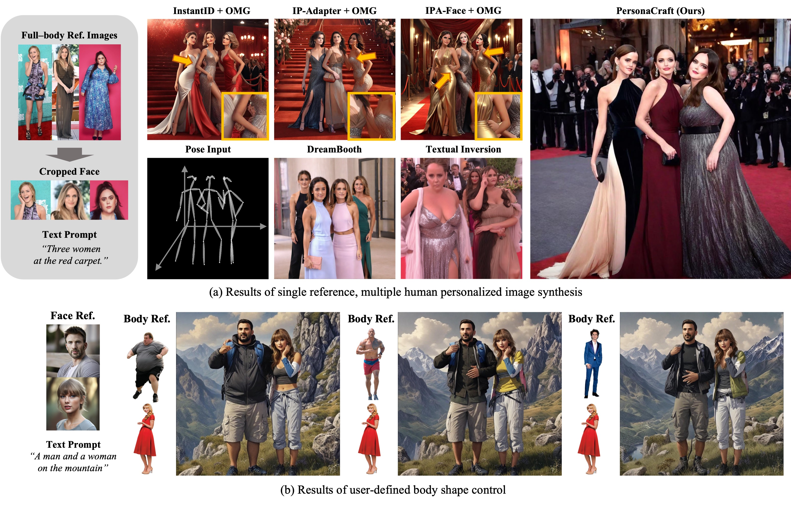
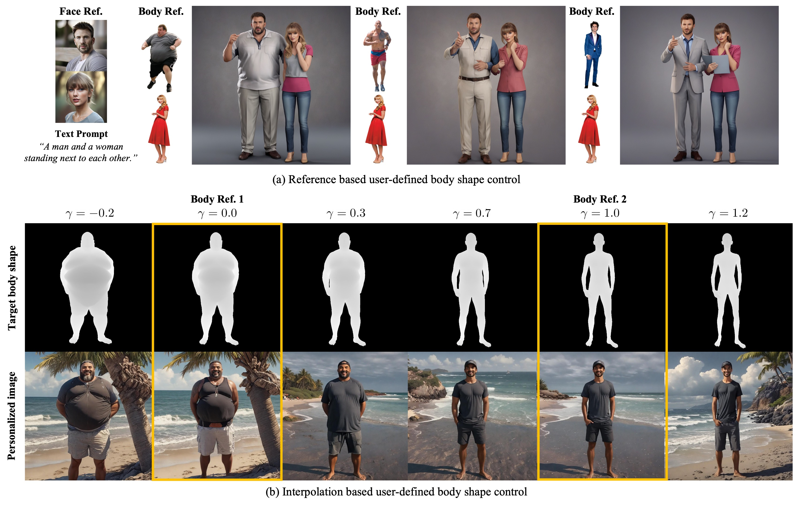

## PersonaCraft: Personalized Full-Body Image Synthesis for Multiple Identities from Single References Using 3D-Model-Conditioned Diffusion

 

  

 

> **PersonaCraft: Personalized Full-Body Image Synthesis for Multiple Identities from Single References Using 3D-Model-Conditioned Diffusion** 
> [Gwanghyun Kim](https://gwang-kim.github.io/)\*, [Suh Yoon Jeon](https://www.linkedin.com/in/suhyoonjeon/)*, [Seunggyu Lee](https://www.linkedin.com/in/seunggyu-lee-18163b263/), [Se Young Chun](https://icl.snu.ac.kr/pi)  
> Seoul National University  
> 
>**Abstract**:  
Personalized image generation has been significantly advanced, enabling the creation of highly realistic and customized images. However, existing methods often struggle with generating images of multiple people due to occlusions and fail to accurately personalize full-body shapes. In this paper, we propose **PersonaCraft**, a novel approach that combines diffusion models with 3D human modeling to address these limitations. Our method effectively manages occlusions by incorporating 3D-aware pose conditioning with SMPLx-ControlNet and accurately personalizes human full-body shapes through SMPLx fitting. Additionally, PersonaCraft enables user-defined body shape adjustments, adding flexibility for individual body customization. Experimental results demonstrate the superior performance of PersonaCraft in generating high-quality, realistic images of multiple individuals while resolving occlusion issues, thus establishing a new standard for multi-person personalized image synthesis.

## Notice 

- The code is comming soon!

## User-Defined Body Shape Control

  

 

## PersonaCraft with Style LoRAs 

  

 

